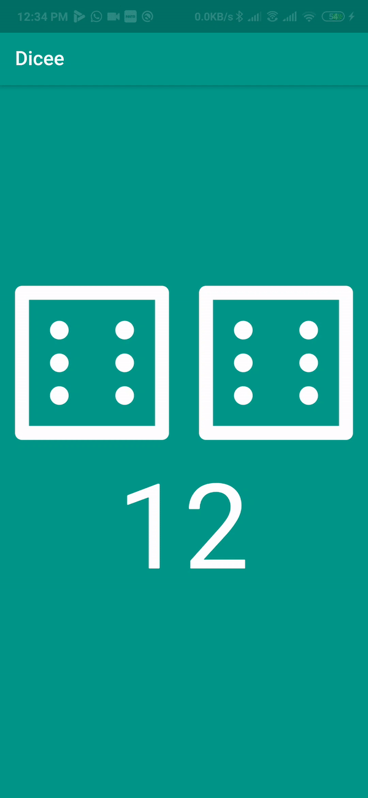

# Dicee
Developed this application as a learning challenge in order to learn stateful widgets in flutter i.e. adding functionalities to each and every flutter widget.
A simple random dice generator, can be used while playing any board game.

## Screenshot

